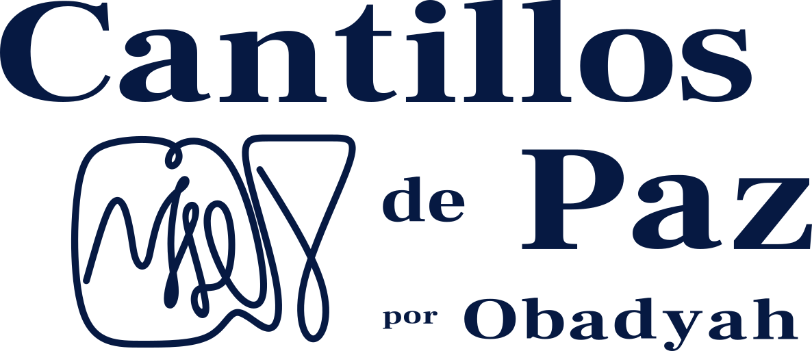

¡[[שלום|Shalom]], bienvenido a mi Cerebro Digital!

![[dito.base#Categories]]

<head>

</head>
<body>

  <a class="instagram-btn" href="https://instagram.com/cantillosdepaz" target="_blank" rel="noopener noreferrer">

Instagram
  </a>

</body>

## Compartir nuestra luz
[[I Crónicas#29 14]] infiere: "Lo que damos a Di-s, [[יהוה]], proviene de Él". Es decir, nada nos pertenece. Compartir la luz que yace en las profundidades de nuestra mente; es solo un pequeño reflejo de la bondad, [[חסד]], que El Eterno emana a los mundos inferiores. Un blog; es solo una pequeña forma tangible de imitarle. De alguna forma extraña, imitarle a Él es un anhelo oculto en nuestro ser, por ello, compartir brota de nuestro interior sin esfuerzo, independientemente de lo novedoso o de lo simple que pueda ser.

## Aprender en Público
"Learning in public", se refiere a compartir nuestro proceso de aprendizaje durante su proceso y no solo el resultado final, para reforzar lo aprendido e integrar nuevas cosmovisiones o conocimientos de los observadores, es decir, encontrar luces que sin la ayuda de otros nos serían ocultas. 

A causa de este concepto, me he embarcado a compartir un poco del conocimiento que El Eterno me ha concedido, en relación con el idioma hebreo, la Torah, la ética y la vida en general. Aun cuando no me considero un experto en los temas mencionados. 

Empero, quizás..., mi proceso pueda inspirar o ayudar a alguien que desconozca lo que tengo por compartir. De igual forma, me puede servir para conectar con diferentes cosmovisiones, las cuales complementen mis areas nubladas.

De cualquier forma, compartir ideas, pensamientos, historias o simplemente escritos: despeja la mente, en virtud de lo cual, nuevas ideas, relaciones o conceptos emergen. 
## El Objetivo Ulterior
Aprender en público es el causante de romper el reposo, de vencer mi impostor interno, de otorgarme el energía para encandecer como faro; usando la luz del Eterno en mí.

Mi intención ulterior es mejorar mi escritura y tener un público al cual vender mis escritos, con el favor del cielo. Un objetivo común, pero extrañamente inconcebible a mi mente, hasta ahora...

Todo objetivo debe ser desarrollado y trabajado hasta llegar a el: so let's ride a little bit, Shall we?

>[!tip] Con la ayuda del Eterno, nos seguiremos viendo en estas páginas o en aquellas. En el futuro próximo o en el por venir...